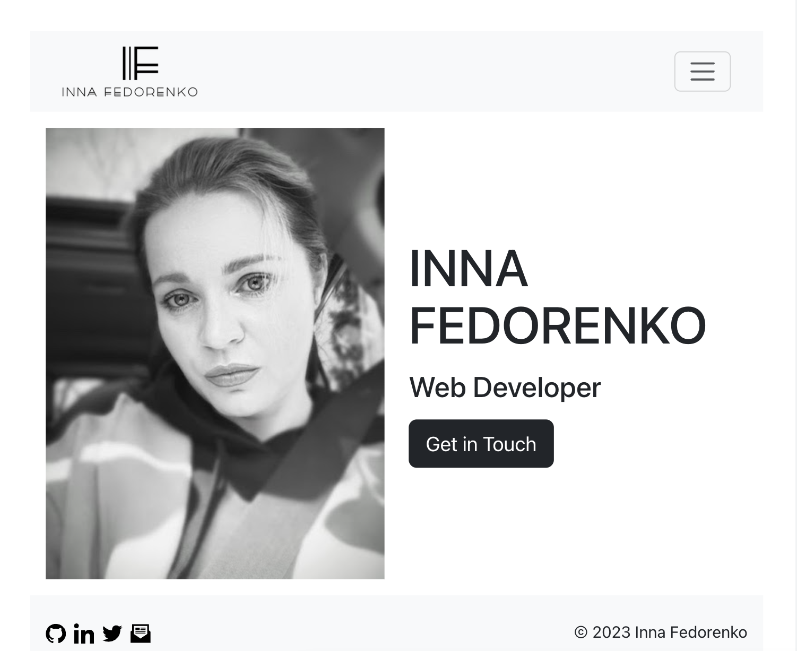

# Inna Fedorenko Portfolio
## Table of Contents
- [Description](#description)
- [Installation]( #installation)
- [Usage](#usage)
- [License](#license)
- [Contributing](#contributing)
- [Tests](#tests)
- [Questions](#questions) 

##  Description
- The Developer Portfolio site was implemented by [Inna Fedorenko](https://github.com/InnaFedorenko).
- [GiHub Link](https://github.com/InnaFedorenko/if_portfolio_react/tree/main)
- [Deployed Application](https://main--stellular-starburst-3938dc.netlify.app/)
- Date: 08-14-2023


### Summary
Being a web developer means being part of a community. You’ll need a place not only to share your projects while you're applying for jobs or working as a freelancer but also to share your work with other developers and collaborate on projects.

Your task is to create a portfolio using your new React skills, which will help set you apart from other developers whose portfolios don’t use the latest technologies.

## User Story

```md
AS AN employer looking for candidates with experience building single-page applications
I WANT to view a potential employee's deployed React portfolio of work samples
SO THAT I can assess whether they're a good candidate for an open position
```

## Acceptance Criteria

```md
GIVEN a single-page application portfolio for a web developer
WHEN I load the portfolio 
THEN I am presented with a page containing a header, a section for content, and a footer
WHEN I view the header
THEN I am presented with the developer's name and navigation with titles corresponding to different sections of the portfolio 
WHEN I view the navigation titles
THEN I am presented with the titles About Me, Portfolio, Contact, and Resume, and the title corresponding to the current section is highlighted 
WHEN I click on a navigation title
THEN the browser URL changes and I am presented with the corresponding section below the navigation and that title is highlighted
WHEN I load the portfolio the first time 
THEN the About Me title and section are selected by default 
WHEN I am presented with the About Me section
THEN I see a recent photo or avatar of the developer and a short bio about them 
WHEN I am presented with the Portfolio section
THEN I see titled images of six of the developer’s applications with links to both the deployed applications and the corresponding GitHub repositories 
WHEN I am presented with the Contact section
THEN I see a contact form with fields for a name, an email address, and a message  
WHEN I move my cursor out of one of the form fields without entering text
THEN I receive a notification that this field is required  
WHEN I enter text into the email address field
THEN I receive a notification if I have entered an invalid email address 
WHEN I am presented with the Resume section
THEN I see a link to a downloadable resume and a list of the developer’s proficiencies
WHEN I view the footer
THEN I am presented with text or icon links to the developer’s GitHub and LinkedIn profiles, and their profile on a third platform (Stack Overflow, Twitter) 
```

##  Installation

### Getting Started

1. Clone this repository to your local machine.
2. Install the project dependencies using `npm install`.
3. Run the development server using `npm run dev`.
4. Open your browser and navigate to the provided local server URL.

### Available Scripts

- `npm run dev`: Starts the development server using Vite.
- `npm run build`: Builds the project for production using Vite.
- `npm run lint`: Runs ESLint to lint JavaScript and JSX files.
- `npm run preview`: Previews the production build using Vite.

### Folder Structure

The project structure is organized for maintainability and scalability:

- `src/`: Contains the main source code of the portfolio.
- `public/`: Contains static assets like images and favicon.


##  Usage
Open [Deployed Application](https://main--stellular-starburst-3938dc.netlify.app/). Enjoy 🐼!


## License
  
  This application is covered under the [MIT License](https://opensource.org/licenses/MIT).
##  Contributing
I welcome contributions, bug reports, and suggestions. Feel free to open issues and pull requests on the [GitHub repository](https://github.com/InnaFedorenko/if-portfolio-react).
##  Tests

##  Questions
If you have any questions, you can reach out to [me](https://github.com/InnaFedorenko) at 
[email](mailto:ivf.fedorenko@gmail.com).